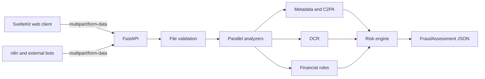

# Transfer Receipt Risk Engine

[](https://github.com/montesgp/receipt-risk-detector/actions/workflows/ci.yml)

> Working title. Replace it when the product receives its final name.

Open-source engine for analyzing images of Argentine transfer receipts and returning an explainable fraud-risk assessment.

The system does **not** certify that a transfer exists and does **not** issue an absolute `REAL` or `FAKE` verdict. It inspects the submitted artifact, extracts financial data, collects technical evidence and returns a reproducible risk score that helps a beneficiary perform manual reconciliation.

## Product principle

```text
No evidence of fraud != proof of authenticity
```

Only reconciliation against the beneficiary's bank account can confirm that the transfer was credited.

## MVP 1

MVP 1 accepts a `JPEG`, `PNG` or `WebP` image and performs:

- File safety and format validation.
- SHA-256 calculation without retaining the image.
- EXIF and creator-software metadata inspection.
- C2PA / Content Credentials inspection when present.
- Local OCR without paid model tokens.
- Extraction of amount, date, parties, CBU/CVU, CUIT/CUIL and operation identifier.
- Deterministic Argentine financial-data validation.
- Explainable fraud-risk scoring.
- JSON response suitable for the web client, n8n, WhatsApp and Telegram bots.

MVP 1 excludes authentication, organizations, persistent history, bank connections, automatic reconciliation and trained fraud-classification models. See [PRD](docs/PRD.md) and [Roadmap](docs/ROADMAP.md).

## Stack

| Area | Technology |
| --- | --- |
| Web | SvelteKit 5, TypeScript, custom CSS |
| API | Python 3.12+, FastAPI, Pydantic |
| Image processing | Pillow, OpenCV |
| OCR | PaddleOCR first; Tesseract as benchmark/fallback candidate |
| Provenance | ExifTool and C2PA-compatible tooling |
| Testing | pytest, Vitest, Playwright |
| Packaging | `uv`, Docker, Docker Compose |
| Persistence | None in MVP 1 |

## Architecture



The frontend is never the source of truth for scoring. FastAPI owns validation, orchestration and the public contract. Analyzer implementations are replaceable adapters. The risk engine is deterministic and versioned.

Read the detailed [architecture](docs/ARCHITECTURE.md).

## API example

```bash
curl -X POST http://localhost:8000/v1/receipts/analyze \
  -H "Accept: application/json" \
  -F "file=@samples/receipt.png"
```

Example response:

```json
{
  "analysis_id": "sha256:4f...",
  "engine_version": "0.1.0",
  "classification": "SUSPICIOUS",
  "risk_score": 74,
  "confidence_score": 86,
  "recommended_action": "MANUAL_RECONCILIATION",
  "signals": [],
  "extracted_data": {},
  "limitations": [
    "This assessment does not confirm that the transfer exists or was credited."
  ]
}
```

Interactive documentation will be available at `/docs`, `/redoc` and `/openapi.json`. The MVP API has no access token, but deployments must enforce file-size limits, timeouts and rate limiting. See [API contract](docs/API.md).

## Local development target

The intended developer experience is:

```bash
docker compose up --build
```

Expected services:

```text
Web:  http://localhost:5173
API:  http://localhost:8000
Docs: http://localhost:8000/docs
```

`docker compose up --build` is target-state until it is wired end-to-end. Until then, run the API
and the web client separately:

```bash
# Terminal 1 — API (must allow the web dev server's origin)
cd apps/api
RECEIPT_RISK_CORS_ALLOWED_ORIGINS=http://localhost:5173 uv run uvicorn receipt_risk.bootstrap.app:app --reload

# Terminal 2 — Web client
cd apps/web
npm install
npm run dev
```

Without `RECEIPT_RISK_CORS_ALLOWED_ORIGINS` set to the web dev server's origin, every request from
the browser fails as a network error indistinguishable from the API being down. See
[Local-Setup](docs/wiki/Local-Setup.md) for the full walkthrough, including `apps/web/env.sample`.

## Repository layout

```text
.
├── apps/
│   ├── api/
│   └── web/
├── docs/
│   ├── API.md
│   ├── ARCHITECTURE.md
│   ├── DESIGN.md
│   ├── PRD.md
│   └── ROADMAP.md
├── samples/
├── AGENTS.md
├── CONTRIBUTING.md
├── LICENSE
├── SECURITY.md
└── README.md
```

## Documentation for contributors and agents

Start in this order:

1. [PRD](docs/PRD.md): product scope and acceptance criteria.
2. [Architecture](docs/ARCHITECTURE.md): boundaries and dependency rules.
3. [API](docs/API.md): public integration contract.
4. [Design](docs/DESIGN.md): UX and visual language.
5. [Roadmap](docs/ROADMAP.md): later stages that must not leak into MVP 1.
6. [AGENTS.md](AGENTS.md): implementation workflow and required derived documentation.

## Privacy and security

- Do not persist submitted receipts in MVP 1.
- Use private temporary files only when an analyzer requires a filesystem path.
- Delete temporary artifacts in a `finally` path.
- Never log raw images, OCR text containing personal data or full financial identifiers.
- Mask sensitive fields in UI and operational logs.
- Treat every upload as hostile input.

See [SECURITY.md](SECURITY.md).

## Open source

Licensed under the [Apache License 2.0](LICENSE). Contributions are welcome through [issues](https://github.com/montesgp/receipt-risk-detector/issues) and pull requests after reading [CONTRIBUTING.md](CONTRIBUTING.md). Process and onboarding documentation lives in the [Wiki](https://github.com/montesgp/receipt-risk-detector/wiki).

## Disclaimer

This software produces a technical risk assessment of a submitted receipt image. It is not a banking service, legal opinion, fraud conviction or guarantee of payment. A low score is not proof that a transfer is authentic. Confirm payment through the beneficiary's bank account before delivering goods or services.
