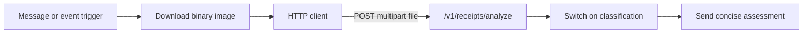

# Public API contract — MVP 1

## 1. Contract principles

- Versioned under `/v1`.
- JSON field names use `snake_case`.
- Analysis accepts standard `multipart/form-data`.
- No access token in MVP 1.
- No cookies or browser session required.
- Errors follow `application/problem+json`.
- OpenAPI is the executable source of truth once implementation begins.

## 2. Endpoints

### `GET /health`

Liveness only. It must not run OCR or expensive dependency checks.

### `GET /ready`

Reports whether required analyzers are initialized and the service can accept work.

### `GET /version`

Example:

```json
{
  "engine_version": "0.3.0",
  "ruleset_version": "2026-09-06",
  "analyzers": {
    "ocr": "paddleocr-adapter/0.1.0",
    "metadata": "exiftool-adapter/0.1.0",
    "provenance": "c2pa-adapter/0.1.0",
    "vision": "mobilenetv3-embedding/1.0.0"
  }
}
```

`/ready`'s `analyzers` map has the same four-entry shape (`ocr`, `metadata`,
`provenance`, `vision`).

### `POST /v1/receipts/analyze`

Request:

```http
Content-Type: multipart/form-data
Accept: application/json
```

Fields:

| Field | Type | Required | Description |
| --- | --- | --- | --- |
| `file` | binary | Yes | JPEG, PNG or WebP; maximum 10 MB initially |

MVP 1 deliberately excludes base64 JSON and remote image URLs. Binary multipart works with browsers and any external automation client (workflow tools, bots, generic HTTP clients) without increasing payload size unnecessarily.

## 3. Response model

```json
{
  "analysis_id": "sha256:4f4a...",
  "engine_version": "0.3.0",
  "ruleset_version": "2026-09-06",
  "classification": "SUSPICIOUS",
  "risk_score": 74,
  "confidence_score": 86,
  "recommended_action": "PRIORITY_MANUAL_RECONCILIATION",
  "signals": [
    {
      "code": "INVALID_CBU_CHECK_DIGIT",
      "category": "financial_consistency",
      "severity": "high",
      "confidence": 0.98,
      "description": "The extracted CBU does not pass its check-digit validation.",
      "evidence": {
        "field": "destination_cbu",
        "masked_value": "**************5678"
      },
      "score_contribution": 25
    }
  ],
  "extracted_data": {
    "amount": {
      "value": "125000.00",
      "confidence": 0.97
    },
    "date_time": {
      "value": "2026-09-01T14:43:00-03:00",
      "confidence": 0.88
    },
    "destination_cbu": {
      "masked_value": "**************5678",
      "confidence": 0.94
    },
    "cuit": {
      "masked_value": "*******4321",
      "confidence": 0.9
    }
  },
  "analyzer_statuses": [
    {
      "analyzer": "ocr",
      "status": "completed",
      "duration_ms": 1840
    }
  ],
  "limitations": [
    "This assessment analyzes the submitted artifact and does not confirm that a bank transfer exists or was credited."
  ],
  "duration_ms": 2310
}
```

`extracted_data` is a map of generic field objects (`value`, `masked_value`,
`confidence`, `is_checksum_valid`); there is no per-field schema and no
`currency`, `beneficiary_name`, or `operation_id` field — those are not
extracted in MVP 1. `is_checksum_valid` is part of the model but is not
currently populated by any analyzer; clients MUST treat it as optional and
never assume its presence alongside a masked identifier.

## 4. Enumerations

```text
classification:
  LOW_RISK
  REVIEW_RECOMMENDED
  SUSPICIOUS
  HIGH_RISK
  INCONCLUSIVE

recommended_action:
  STANDARD_MANUAL_RECONCILIATION
  PRIORITY_MANUAL_RECONCILIATION
  DO_NOT_RELY_ON_RECEIPT

severity:
  info
  low
  medium
  high
  critical

analyzer status:
  completed
  partial
  failed
  timed_out

signal category:
  metadata
  provenance
  financial_consistency
  data_quality
  visual
```

## 4a. Scoring reference (active ruleset)

These are the current values for the active ruleset only — every response echoes its own
`ruleset_version`; if it differs from `2026-09-06`, do not assume these numbers still apply (per
`CONTRIBUTING.md`, a weight/floor change always ships as a new frozen ruleset version, never a
silent edit to a shipped one).

### Signal codes

| Code | Category | Severity | Weight | Critical floor | Trigger |
| --- | --- | --- | --- | --- | --- |
| `METADATA_EDITOR_SOFTWARE` | `metadata` | low | 10 | — | Embedded EXIF metadata names editing software (Photoshop, GIMP, Canva, etc.). |
| `VALID_AI_GENERATED_CLAIM` | `provenance` | critical | 90 | 85 | A cryptographically valid, fully-trusted C2PA manifest declares algorithmic (AI) generation. |
| `AI_GENERATED_CLAIM_UNTRUSTED_SIGNER` | `provenance` | critical | 50 | 85 | Same AI-generation claim, but signed by an unrecognized/untrusted CA — the claim itself is cryptographically intact, only the trust anchor is unfamiliar. Forces the same verdict as `VALID_AI_GENERATED_CLAIM`; kept as a separate code only for audit/explainability in `signals[]`. |
| `PROVENANCE_VALIDATION_FAILED` | `provenance` | medium | 15 | — | A C2PA manifest is present but fails structural/cryptographic validation (genuine tampering or a broken signature). |
| `INVALID_CBU_CHECK_DIGIT` | `financial_consistency` | high | 40 | — | Extracted CBU/CVU fails its check-digit algorithm. |
| `INVALID_CUIT_CHECK_DIGIT` | `financial_consistency` | high | 30 | — | Extracted CUIT/CUIL fails its check-digit algorithm. |
| `AMOUNT_DATE_CONTRADICTION` | `financial_consistency` | medium | 20 | — | Multiple extracted occurrences of the same field (amount or date) disagree with each other. |
| `DATE_OUT_OF_BOUNDS` | `financial_consistency` | medium | 15 | — | Extracted date falls outside the plausibility window. |
| `CORE_FIELD_EXTRACTION_FAILED` | `data_quality` | medium | 15 | — | OCR could not reliably extract one or more core fields (amount, CBU/CVU, CUIT, date). |
| `ANALYZER_UNAVAILABLE` | `data_quality` | info | 0 | — | An analyzer did not run or complete. Not fraud evidence — only lowers `confidence_score`, never `risk_score`. |
| `VISUAL_ANOMALY_DETECTED` | `visual` | low or medium | 20 | — | The receipt's MobileNetV3 embedding is a cosine-distance outlier vs. the bundled reference set. Pixel-space evidence only — never claims AI generation, never forces a verdict alone. |

### Severity multipliers

| Severity | Multiplier |
| --- | --- |
| info | 0.0 |
| low | 0.5 |
| medium | 1.0 |
| high | 1.5 |
| critical | 2.0 |

`critical_floor` only applies to `critical`-severity signals — it's the only mechanism that lets
one signal force a verdict on its own, by setting a floor under `risk_score` regardless of what
else fired.

### Combination floor

`{CORE_FIELD_EXTRACTION_FAILED, DATE_OUT_OF_BOUNDS}` together floor `risk_score` at **55**
(SUSPICIOUS) even though neither code alone reaches that far — deliberately capped below
`HIGH_RISK`'s 85 floor, which stays reserved for cryptographic AI-claim evidence.

### Risk bands

| `risk_score` | Classification | `recommended_action` |
| --- | --- | --- |
| 0-24 | `LOW_RISK` | `STANDARD_MANUAL_RECONCILIATION` |
| 25-49 | `REVIEW_RECOMMENDED` | `STANDARD_MANUAL_RECONCILIATION` |
| 50-74 | `SUSPICIOUS` | `PRIORITY_MANUAL_RECONCILIATION` |
| 75-100 | `HIGH_RISK` | `DO_NOT_RELY_ON_RECEIPT` |
| n/a — override, not a band | `INCONCLUSIVE` | `PRIORITY_MANUAL_RECONCILIATION` |

### How the two scores are actually computed

- `risk_score`: for every signal that fired, compute `weight × severity multiplier × confidence`
  (truncated to an integer) and add them all up, capped at 100. Then two kinds of floors can only
  push the total UP, never down: any `critical`-severity signal with a `critical_floor` entry
  forces at least that floor; and the `combination_floor` above forces at least 55 if both its
  codes fired together.
- `confidence_score` (0-100): NOT about fraud — it's how much of the analysis the engine could
  actually complete. Each of the 4 analyzer roles (ocr weight 0.43, metadata 0.17, provenance
  0.25, vision 0.15) contributes `role_weight × status_quality × completeness`, summed and turned
  into a percentage. `status_quality` is 1.0 completed / 0.5 partial / 0.0 failed or timed_out.
  `completeness` for OCR is "how many of the 4 core fields it actually normalized, out of 4"; for
  the other three roles it's 1 if they completed and produced real evidence, else 0.
- `INCONCLUSIVE` overrides whatever band `risk_score` would land in, whenever either: overall
  `confidence_score` falls below 35, OR the OCR analyzer ran (didn't fail/time out) but extracted
  zero of the 4 core fields and no critical-floor signal fired. A single failed/timed-out analyzer
  by itself never forces `INCONCLUSIVE`.

## 5. Error format

```json
{
  "type": "https://project.example/problems/unsupported-image",
  "title": "Unsupported image",
  "status": 415,
  "detail": "The uploaded content could not be decoded as JPEG, PNG or WebP.",
  "instance": "/v1/receipts/analyze",
  "request_id": "req_01...",
  "code": "UNSUPPORTED_IMAGE"
}
```

Expected errors:

| Status | Code |
| ---: | --- |
| 400 | `MISSING_FILE` |
| 413 | `FILE_TOO_LARGE` |
| 415 | `UNSUPPORTED_IMAGE` |
| 422 | `IMAGE_DIMENSIONS_EXCEEDED` |
| 429 | `RATE_LIMITED` |
| 504 | `ANALYSIS_TIMEOUT` |

**`ANALYZER_UNAVAILABLE` is not a response status.** A failed or unavailable
analyzer (e.g. OCR models missing, ExifTool binary absent) never aborts the
request — per the locked "never abort, always signal" decision, it surfaces
as a `CORE_FIELD_EXTRACTION_FAILED`-style `ValidationSignal` inside a normal
`200` `FraudAssessment`, contributing to `risk_score`, and can push
`classification` to `INCONCLUSIVE` if overall evidence coverage falls below
threshold (see `openspec/specs/receipt-analysis/spec.md`). `ANALYZER_UNAVAILABLE`
only appears internally as an `AnalyzerResult.error_code`, never on the wire.

## 5b. Rate limiting

Implements NFR-003 and proposal decision D2. Full mechanism, algorithm and buckets are specified in
`openspec/changes/mvp-init-foundation/specs/api-rate-limiting/spec.md` and
`openspec/changes/mvp-init-foundation/design.md` (DD5, DD6); this section documents the client-facing
contract.

**Limits** (env-configurable, defaults):

| Bucket | Default limit | Applies to |
| --- | --- | --- |
| `default` | 30 requests/minute | Every non-exempt route |
| `analyze` | 10 requests/minute | `POST /v1/receipts/analyze` |

Exempt paths: `OPTIONS` preflights, `GET /health`, `GET /ready`, `GET /version`.

**`429` response body** (`application/problem+json`):

```json
{
  "type": "https://project.example/problems/rate-limited",
  "title": "Too many requests",
  "status": 429,
  "detail": "Rate limit exceeded for this client. Retry after the indicated interval.",
  "instance": "/v1/receipts/analyze",
  "request_id": "req_01...",
  "code": "RATE_LIMITED"
}
```

**Headers on every response** (limited or not):

| Header | Meaning |
| --- | --- |
| `RateLimit-Limit` | Bucket capacity for the matched route |
| `RateLimit-Remaining` | Tokens remaining after this request |
| `RateLimit-Reset` | Seconds until the bucket is fully refilled |
| `Retry-After` | Present only on `429`; integer seconds, ceiling of the time to the next available token |

CORS headers (`Access-Control-Allow-Origin`, etc.) are present on `429` responses for allowlisted
origins, because the rate limiter runs inside the CORS middleware, not in front of it.

**Documented MVP1 limitation**: the token bucket is in-process and non-persistent. It resets on every
restart/redeploy and is not shared across multiple running instances — horizontal scaling multiplies
the effective limit by the instance count. This is abuse damping, not a distributed rate-limiting
guarantee. See `docs/ARCHITECTURE.md` §11 for the architectural framing and
`docs/adr/0003-rate-limit-token-bucket.md` for the algorithm decision. Shared-store limiting is
deferred to the authentication phase (`docs/ROADMAP.md` Phase 4).

## 6. External automation clients

Any server-side automation — a workflow-automation tool, a WhatsApp/Telegram bot, a generic backend — is an intended consumer of this API, on equal footing with the web client. None of it requires browser state or credentials (§5).



Request requirements, for any client:

- Method: `POST`.
- Body content type: `multipart/form-data`.
- Parameter name: `file`.
- Response: JSON.
- Client timeout: greater than the documented API analysis timeout.

Bots should communicate the classification, score, strongest signals and the need for bank reconciliation. They must not tell the user that the transfer is definitively real or fake.

## 7. Compatibility policy

- Additive response fields may appear within `v1`.
- Existing fields, enum meanings and error codes are not removed or repurposed within `v1`.
- New mandatory request fields require a new API version.
- Every scoring response exposes ruleset and engine versions.
