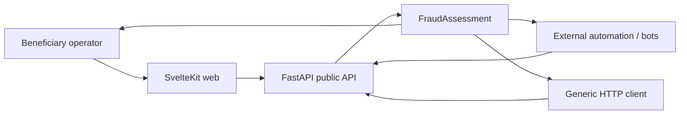
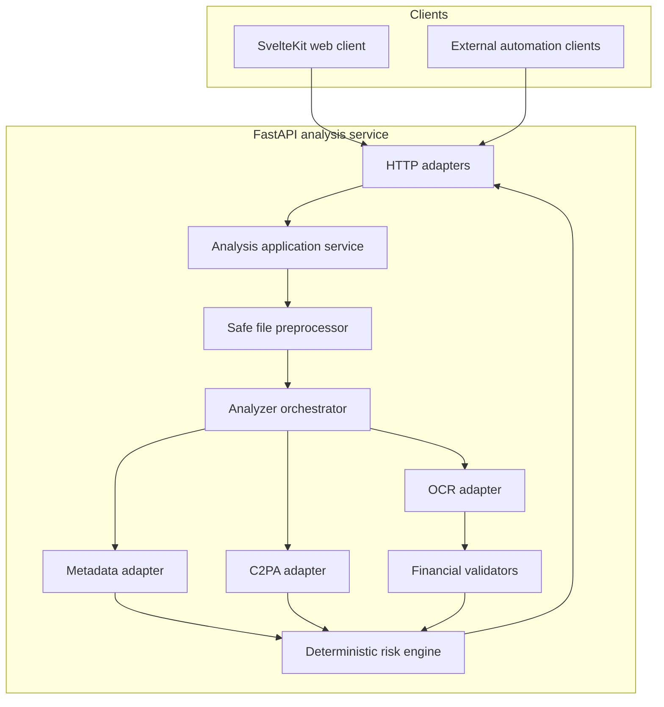
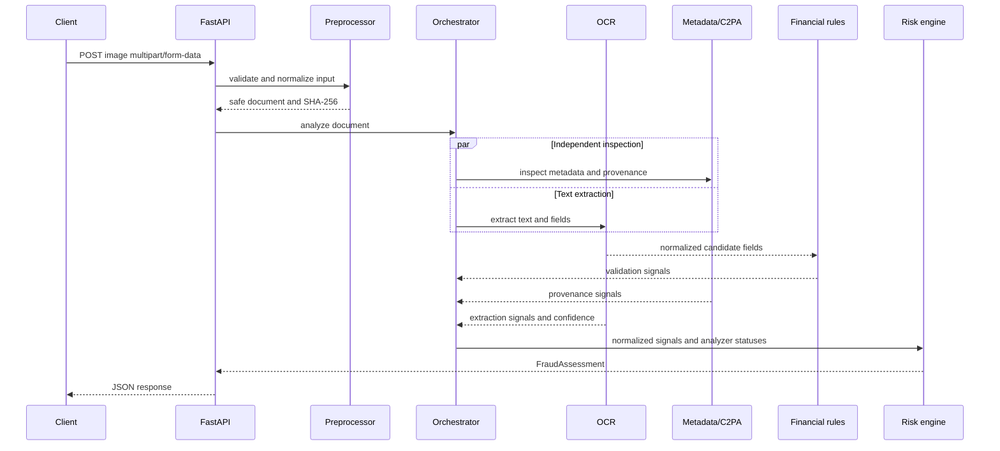
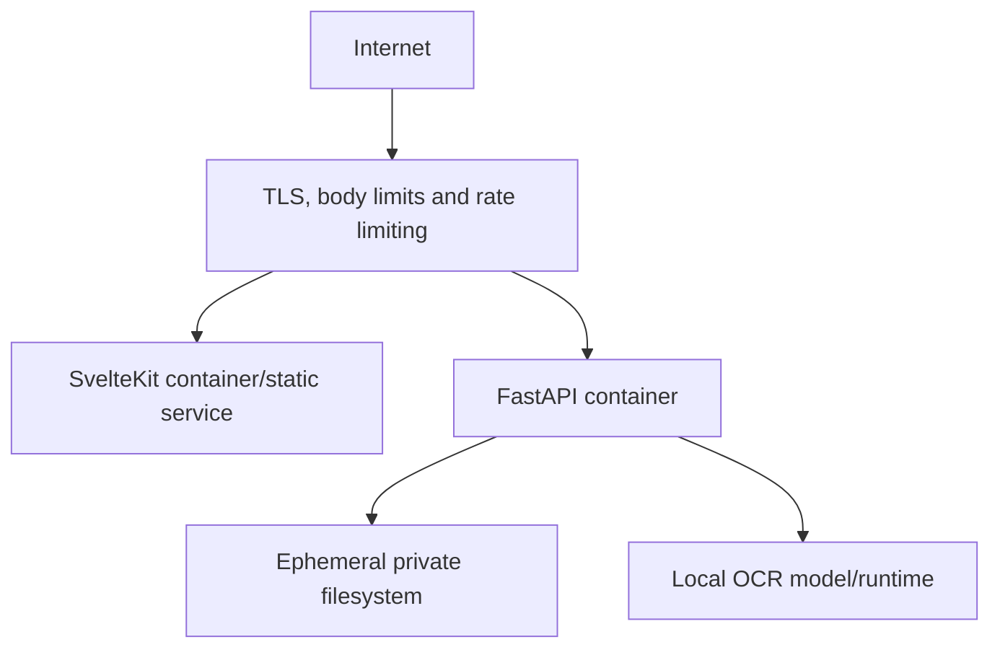

# Architecture

## 1. Architecture decision

MVP 1 is a **modular monolith** with two deployable applications:

- A SvelteKit web client.
- A FastAPI analysis service.

There is no database, queue or distributed workflow in MVP 1. This minimizes operational complexity while preserving clear internal boundaries for future analyzers and reconciliation adapters.

## 2. System context



Editable source: [`docs/diagrams/system-context.drawio`](diagrams/system-context.drawio) (draw.io, opens in
[diagrams.net](https://app.diagrams.net) or the draw.io desktop app). Shows the same actors and system
boundary as the Mermaid view above, redrawn as a source-editable diagram per D3.

> Diagrams are delivered as `.drawio` source links rather than exported SVGs. This is the intended
> final approach, not a pending step: it keeps the rendered view and the editable source identical by
> construction and avoids export drift. View a diagram via GitHub's draw.io viewer/extension, at
> [diagrams.net](https://app.diagrams.net), or in the draw.io desktop app after downloading the file.

### 2.1 Use-case diagram

Editable source: [`docs/diagrams/uml-use-case.drawio`](diagrams/uml-use-case.drawio). UML use-case
diagram covering the three PRD actors — beneficiary operator, external automation (workflow tools,
bots, generic HTTP clients), and contributor/integrator — against the `analyze receipt` use case and its
`<<include>>`/`<<extend>>` relationships (preprocess, extract, score, handle partial/failed analyzer).
See `architecture-documentation` spec, scenario "Use-case diagram covers actors".

## 3. Container view



Editable source: [`docs/diagrams/container-view.drawio`](diagrams/container-view.drawio). Same layers,
ports and adapters as the Mermaid view above, redrawn as a source-editable diagram per D3.

## 4. Processing sequence



Financial validation depends on OCR output. Metadata/C2PA inspection can run concurrently with OCR. Implement bounded concurrency; do not spawn unbounded work per request.

Editable source: [`docs/diagrams/processing-sequence.drawio`](diagrams/processing-sequence.drawio).
Same UML sequence for `POST /v1/receipts/analyze` as the Mermaid view above, redrawn as a
source-editable diagram per D3.

### 4.1 Activity diagram

Editable source:
[`docs/diagrams/uml-activity-receipt-analysis.drawio`](diagrams/uml-activity-receipt-analysis.drawio).
UML activity diagram with swimlanes for client, API, analyzers and risk engine, covering
upload → preprocess → analyze → score → respond, including the fork/join for concurrent
metadata/C2PA and OCR inspection and explicit decision outcomes for `INCONCLUSIVE` and every
`4xx`/`429` path. This diagram supersedes the PRD §7 flowchart for this flow (DD2) and doubles as
the visual index of the error table in §9 below. See `architecture-documentation` spec, scenario
"Activity diagram covers the full flow".

## 5. Layering and dependency direction

```text
Adapters/API  ───────► Application ───────► Domain
Adapters/Tools ──────► Application ports ─► Domain
```

### Domain

Owns:

- `FraudAssessment`.
- `ValidationSignal`.
- Risk classifications and severity.
- Extracted financial value types.
- Scoring rules and policies.

Must not import FastAPI, Pydantic transport models, OCR libraries, OpenCV, ExifTool or C2PA implementations.

### Application

Owns:

- Analysis use case.
- Analyzer ports.
- Orchestration and time budgets.
- Translation of analyzer outcomes into normalized evidence.
- Cleanup coordination.

### Adapters

Own:

- FastAPI request/response models.
- PaddleOCR/Tesseract integration.
- ExifTool integration.
- C2PA tool integration.
- Image decoding and OpenCV/Pillow operations.
- Deployment-specific rate limiting and temporary storage.

## 6. Suggested repository structure

```text
apps/
├── api/
│   ├── pyproject.toml
│   ├── src/receipt_risk/
│   │   ├── domain/
│   │   ├── application/
│   │   ├── adapters/
│   │   │   ├── api/
│   │   │   ├── metadata/
│   │   │   ├── provenance/
│   │   │   └── ocr/
│   │   └── bootstrap/
│   └── tests/
└── web/
    ├── src/lib/
    │   ├── api/
    │   ├── components/
    │   ├── features/receipt-analysis/
    │   └── i18n/
    └── tests/
```

## 7. Analyzer contract

Each analyzer should return a typed result rather than throwing tool-specific exceptions across the boundary.

```python
class AnalyzerResult:
    analyzer: str
    version: str
    status: Literal["completed", "partial", "failed", "timed_out"]
    signals: list[ValidationSignal]
    extracted_fields: list[ExtractedField]
    duration_ms: int
    error_code: str | None
```

The exact Python design belongs in the SDD. This example establishes intent, not mandatory syntax.

## 8. Risk engine

The risk engine:

- Consumes normalized signals only.
- Applies a versioned ruleset.
- Caps the final risk score to `0..100`.
- Calculates confidence from evidence availability and analyzer quality, not as `100 - risk_score`.
- Can return `INCONCLUSIVE` when evidence coverage is below a defined threshold.
- Emits a breakdown sufficient to reproduce the result.

The engine must not present the score as a calibrated probability until a documented evaluation justifies that interpretation.

## 9. Error and partial-result strategy

| Failure | Behavior |
| --- | --- |
| Invalid/corrupt/oversized file | Reject request with `4xx` problem details |
| Unsafe pixel dimensions | Reject before analysis |
| OCR failure | Continue only if other evidence is meaningful; reduce confidence |
| Metadata absent | Neutral result; continue |
| C2PA unsupported | Continue; record analyzer status |
| Analyzer timeout | Partial result when safe; reduce confidence |
| Risk engine failure | Return `5xx`; never invent a score |

## 10. Performance strategy

- Stream upload to bounded temporary storage rather than duplicating full buffers repeatedly.
- Decode once and share a safe normalized representation where possible.
- Run OCR and provenance/metadata work concurrently.
- Set per-analyzer and whole-request time budgets.
- Keep models warm within the API process when memory permits.
- Avoid frontend server hops: web clients may call FastAPI directly under configured CORS, or use a thin proxy only when deployment requires it.
- Benchmark before introducing queues, workers or microservices.

## 11. Security and privacy boundaries

- Temporary directory is private to the process/container.
- Cleanup runs on success, failure, cancellation and timeout paths.
- The engine never fetches user-provided remote URLs in MVP 1.
- Subprocess adapters use fixed executables and argument arrays, never shell-concatenated user input.
- Logs use masked identifiers and structured error codes.
- CORS is an explicit allowlist in deployed environments.
- Public access is protected operationally by rate, body-size and concurrency limits even without API credentials.

**Rate-limit scope**: the concrete mechanism is an in-process, per-IP token bucket ASGI middleware
(no Redis, no external persistence — see `docs/API.md` §5 and
`openspec/changes/mvp-init-foundation/specs/api-rate-limiting/spec.md`). Its state lives in process
memory: it resets on every restart/redeploy and is not shared across instances, so horizontal scaling
multiplies the effective limit by instance count. This is abuse damping, not a security control
against distributed abuse; shared-store limiting is deferred to the authentication phase (Phase 4,
`docs/ROADMAP.md`). See `docs/adr/0003-rate-limit-token-bucket.md`.

## 12. Deployment view



Railway, Cloud Run, Azure Container Apps or a VM can host the containers. Hosting choice is not an MVP architecture dependency.

Editable source: [`docs/diagrams/deployment-railway.drawio`](diagrams/deployment-railway.drawio),
showing the two-environment Railway topology: `dev` branch → Railway staging, `main` branch → Railway
production (D5, `CONTRIBUTING.md` gitflow policy).

**Railway is the deployment preference, not an architecture dependency (D3/D5).** It is the concrete
target used for the diagram above and for the gitflow policy in `CONTRIBUTING.md`, chosen for
operational convenience during MVP1. Nothing in this architecture requires Railway-specific
primitives; the container boundary in the diagram above (`Internet → edge → web/API containers →
ephemeral filesystem/local OCR`) is portable to Cloud Run, Azure Container Apps or a VM without
redesign. See `docs/adr/0001-railway-as-deployment-target.md`.

## 13. Evolution boundaries

Future components must enter through ports:

- Bank templates as analyzers.
- Visual forensics as analyzers.
- Local ML models as analyzers.
- Organization/history storage behind repositories.
- Bank reconciliation behind provider-specific gateways.

Do not prebuild these capabilities into MVP 1. Preserve extension points only where an actual boundary already exists.
