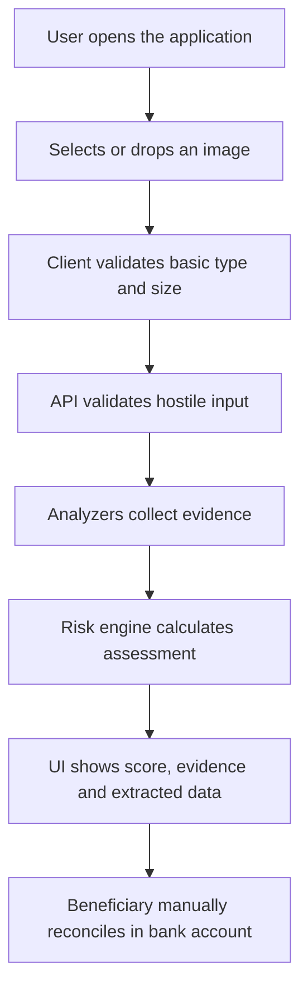

# Product Requirements Document — MVP 1

**Product:** Transfer Receipt Risk Engine  
**Status:** Ready for technical design  
**Version:** 1.0  
**Primary market:** Argentina  
**Delivery:** Open-source web application and public HTTP API

## 1. Product summary

People and organizations commonly receive an image as evidence of a bank or wallet transfer. Images can be manipulated, recreated with HTML/CSS, edited manually or generated by AI. The beneficiary often lacks a fast way to inspect the artifact before manually checking the destination account.

MVP 1 analyzes the receipt image and returns an explainable risk assessment based on available evidence. It assists manual reconciliation; it does not replace it.

## 2. Problem statement

The beneficiary needs to answer two different questions:

1. **Does the submitted artifact show technical or documentary signs of risk?** MVP 1 addresses this.
2. **Did the transfer actually reach the beneficiary's account?** Only later bank reconciliation can answer this.

Conflating these questions creates dangerous false certainty. The product must preserve the distinction everywhere.

## 3. Product principles

1. **Evidence over verdicts.** Return signals and scores, not an absolute declaration.
2. **Explainability.** Every material score contribution is visible and understandable.
3. **Determinism.** Identical normalized evidence and ruleset versions produce the same score.
4. **Privacy by default.** Do not persist receipts in MVP 1.
5. **Local-first analysis.** No paid LLM tokens in the required processing path.
6. **API-first interoperability.** The browser, n8n and bots use the same public API.
7. **Manual reconciliation remains explicit.** Low risk never means confirmed payment.

## 4. Goals

- Accept common transfer-receipt image formats through web and API.
- Inspect metadata and verifiable content provenance.
- Extract relevant financial information using local OCR.
- Validate Argentine identifiers and document consistency.
- Generate separate risk and confidence scores.
- Provide evidence that a human can use during manual reconciliation.
- Offer a simple, fast, responsive and accessible web experience.
- Publish complete OpenAPI documentation without requiring authentication in MVP 1.
- Establish a modular base for bank-specific, model-based and reconciliation capabilities later.

## 5. Non-goals for MVP 1

- Proving that a transfer exists.
- Checking the beneficiary's bank account.
- Automatically accepting or rejecting a payment.
- Identifying the person who manipulated an image.
- Determining with certainty that HTML/CSS produced an image.
- Generic AI-image detection based solely on pixels.
- User accounts, organizations, roles or permissions.
- Persistent analysis history or database storage.
- Billing, subscriptions or commercial quotas.
- Public API keys or OAuth.
- Training proprietary machine-learning models.
- Complete bank-template recognition.

## 6. Users and actors

### 6.1 Beneficiary operator

A merchant, employee or organization member who receives the image and wants guidance before checking the account.

### 6.2 External automation

An n8n workflow, WhatsApp bot, Telegram bot or generic HTTP client that submits an image and consumes structured JSON.

### 6.3 Contributor/integrator

A developer who runs the engine, reviews the rules, contributes an analyzer or integrates the API.

## 7. Primary user journey



## 8. Functional requirements

### FR-001 — Image submission

The system shall accept one `JPEG`, `PNG` or `WebP` image through drag and drop, file selection or `multipart/form-data` API request.

Acceptance criteria:

- Client and server enforce a configurable maximum, initially 10 MB.
- The server validates decoded content rather than trusting filename or declared MIME.
- A corrupt or unsupported image returns a documented `4xx` error.
- The web flow requires no account.

### FR-002 — Safe preprocessing

The system shall validate dimensions, pixel count and decodability before analysis.

Acceptance criteria:

- Excessive dimensions/pixel counts are rejected.
- Input receives a SHA-256 identifier.
- Temporary files are private and deleted after processing, including failure paths.
- Raw file content never appears in application logs.

### FR-003 — Metadata inspection

The system shall inspect embedded metadata when present.

The analyzer may report creator software, editing software, timestamps, EXIF fields and suspicious inconsistencies. Absence of metadata shall not reduce risk or imply authenticity.

### FR-004 — Provenance inspection

The system shall attempt to detect and validate C2PA / Content Credentials claims.

Possible normalized results include:

```text
VALID_AI_GENERATED_CLAIM
VALID_AI_EDITED_CLAIM
VALID_NON_AI_PROVENANCE
INVALID_OR_TAMPERED_CLAIM
NO_CLAIM_FOUND
UNSUPPORTED_CLAIM
ANALYZER_ERROR
```

`NO_CLAIM_FOUND` is neutral evidence. A valid AI-generated or AI-edited claim is a critical signal about the artifact, not a statement about bank settlement.

### FR-005 — Local OCR

The system shall run OCR locally without paid per-request model tokens.

It should extract, when visible:

- Amount and currency.
- Transfer date and time.
- Originator and beneficiary names.
- Origin and destination CBU/CVU.
- CUIT/CUIL.
- Financial institution or wallet.
- Operation or transaction identifier.
- Free-text concept.

Every extracted field includes raw text where safe, normalized value and extraction confidence.

### FR-006 — Financial validation

The system shall apply deterministic validators to extracted values, including:

- CBU/CVU length and check digits.
- CUIT/CUIL check digit.
- Argentine monetary normalization.
- Valid and non-future dates within configurable tolerance.
- Contradictory duplicate values.
- Presence of expected core receipt fields.

### FR-007 — Explainable scoring

The system shall produce:

- `classification`.
- `risk_score` from 0 to 100.
- `confidence_score` from 0 to 100.
- `recommended_action`.
- Ordered `signals` with severity, confidence, explanation and score contribution.
- `ruleset_version` and `engine_version`.

Initial classifications:

| Classification | Initial range | Meaning |
| --- | ---: | --- |
| `LOW_RISK` | 0–29 | No strong risk evidence was found; not proof of authenticity |
| `REVIEW_RECOMMENDED` | 30–59 | Evidence warrants human review |
| `SUSPICIOUS` | 60–79 | Material inconsistencies or provenance concerns exist |
| `HIGH_RISK` | 80–100 | Strong artifact-level risk evidence exists |
| `INCONCLUSIVE` | Separate state | Evidence quality is insufficient for a meaningful classification |

Ranges are initial product configuration, not empirically calibrated probabilities. They must remain versioned and testable.

### FR-008 — Results UI

The web client shall show:

- Risk score and classification.
- Confidence as a separate value.
- Plain-language limitation statement.
- Processing steps and completion state.
- Evidence ordered by severity.
- Extracted fields with sensitive values masked by default.
- Recommended manual-reconciliation checklist.
- A way to analyze another receipt.
- A way to copy the structured result.

The UI must not use “real,” “genuine,” “fake” or “verified transfer” as outcome labels.

### FR-009 — Public API

The API shall expose:

```text
GET  /health
GET  /ready
GET  /version
POST /v1/receipts/analyze
GET  /openapi.json
GET  /docs
GET  /redoc
```

The analysis endpoint is synchronous for MVP 1. It shall work without cookies, browser state or access tokens. Operational abuse controls remain required.

### FR-010 — External automation compatibility

The API shall support a standard n8n HTTP Request node using binary `multipart/form-data` input and structured JSON output.

No webhook callback or polling flow is required in MVP 1.

### FR-011 — Privacy

The system shall not retain uploaded images, OCR output or results beyond the request lifecycle in MVP 1.

Infrastructure request logs may retain minimal operational metadata such as request ID, duration, status code and engine version, but never raw financial content.

### FR-012 — Internationalization foundation

**Superseded by an approved scope expansion (D1).** The original wording below ("foundation only") is
retained for history; the binding requirement is now the expanded one in
`openspec/changes/mvp-init-foundation/specs/ui-localization-and-theming/spec.md`, which requires full
bilingual ES/EN UI copy and a working light/dark theme switcher, both with persisted user choice. See
`docs/adr/0002-fr-012-scope-expansion.md` for the rationale and roadmap scope-control basis.

Original wording (superseded): MVP 1 UI copy is Spanish-first. User-facing strings shall be
centralized so English can be added without restructuring components.

## 9. Non-functional requirements

### NFR-001 — Performance

- Target p50 end-to-end analysis: under 4 seconds on the documented reference CPU and fixture set.
- Target p95: under 10 seconds.
- UI interaction feedback: within 100 ms after file selection.
- Show processing state when a request exceeds 300 ms.

These are engineering targets and must be rebaselined against real hardware and fixtures.

### NFR-002 — Reliability

- One analyzer failure must be representable as partial evidence when safe.
- A critical preprocessing failure stops the request.
- All errors return a stable problem-details format.

### NFR-003 — Security

- Treat uploads as untrusted.
- Enforce body, image dimension, pixel and timeout limits.
- Rate limit using an in-process, per-IP token-bucket ASGI middleware (default 30 req/min overall,
  10 req/min on the analysis endpoint), returning `429` with problem-details and `Retry-After`. See
  `docs/API.md` §5 and `openspec/changes/mvp-init-foundation/specs/api-rate-limiting/spec.md` for the
  full mechanism, headers and the documented per-instance/reset-on-restart limitation.
- Disable arbitrary remote URL fetching in MVP 1.
- Run processors with least privilege and bounded resources.

### NFR-004 — Accessibility

- Keyboard-operable upload and controls.
- Visible focus states.
- Status announcements through an ARIA live region.
- WCAG AA color contrast.
- Status never communicated by color alone.

### NFR-005 — Observability

Record request ID, stages, duration, error category, analyzer version and aggregate result classification without logging sensitive data.

### NFR-006 — Reproducibility

The response records engine, analyzer and ruleset versions. Scoring tests use frozen normalized signal fixtures.

## 10. Core domain model

```text
FraudAssessment
├── analysis_id
├── engine_version
├── ruleset_version
├── classification
├── risk_score
├── confidence_score
├── recommended_action
├── signals[]
├── extracted_data
├── analyzer_statuses[]
└── limitations[]

ValidationSignal
├── code
├── category
├── severity
├── confidence
├── description
├── evidence
└── score_contribution
```

## 11. Success metrics for MVP 1

- A contributor can run web and API locally using documented commands.
- A user can submit a supported image and understand the output without documentation.
- n8n can submit a binary image and route on `classification` or `risk_score`.
- Every score contribution is traceable to a rule and signal.
- The system passes cleanup and no-sensitive-logging tests.
- A versioned evaluation fixture set reports extraction coverage and known failure modes.

MVP 1 success is **not** measured by an unsupported “fraud detection accuracy” claim.

## 12. Release acceptance checklist

- All FR-001 through FR-012 acceptance criteria pass.
- Public OpenAPI examples match actual responses.
- Docker-based local setup works from a clean checkout.
- No real personal receipts exist in the repository.
- Error, timeout and partial-analysis flows have tests.
- Responsive UI passes agreed desktop and mobile viewport checks.
- Disclaimer is visible in upload and result states.
- Apache 2.0 license, contribution and security documents are present.

## 13. Open questions for SDD/RDD

- Select PaddleOCR or Tesseract as initial production adapter after a documented Argentine-receipt benchmark.
- Select the supported C2PA toolchain and license-compatible integration.
- Define the initial scoring weights and how `INCONCLUSIVE` overrides range classification.
- Define the reference CPU used for latency targets.
- Decide whether PDF support belongs in MVP 1. It is excluded by default.
