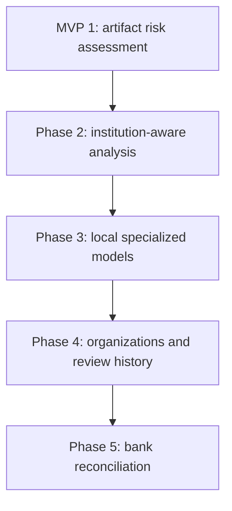

# Product roadmap and scope boundaries

There is one MVP: **MVP 1**. Later items are product phases, not requirements for the initial release.

## Scope overview

## MVP 1 — Artifact risk assessment

Status: **Current implementation scope**

Includes:

- Public web upload and documented API.
- JPEG, PNG and WebP.
- Safe preprocessing and SHA-256 request identifier.
- Metadata and C2PA inspection.
- Local OCR.
- Argentine CBU/CVU and CUIT/CUIL validation.
- Date, amount and required-field consistency checks.
- Explainable risk and confidence scoring.
- Manual-reconciliation guidance.
- No authentication, database or receipt persistence.
- No paid LLM/model tokens.

Release outcome:

> “The submitted artifact has this level of risk, based on these observable signals. Check these extracted values against the beneficiary account.”

## Phase 2 — Institution-aware document analysis

Purpose: increase evidence quality without claiming bank settlement.

Candidate capabilities:

- Bank/wallet identification.
- Versioned receipt schemas for major Argentine institutions.
- Expected wording, field presence and approximate layout.
- QR parsing and payload validation.
- Logo and typography consistency as supporting heuristics.
- Compression, resampling and region-manipulation heuristics.
- Duplicate artifact/hash detection if persistence is introduced deliberately.

Constraints:

- Layout mismatches remain heuristic signals.
- The system must not claim that pixels prove HTML/CSS origin.
- Institution profiles require dated fixtures because banking UIs change.

## Phase 3 — Local specialized models

Purpose: add learned evidence after a measurable dataset exists.

Candidate capabilities:

- Receipt/institution classifier.
- Local manipulation detector.
- Local AI-generated-image signal detector.
- ONNX Runtime or PyTorch inference.
- Model registry, versioning and evaluation reports.

Entry criteria:

- Legally usable, anonymized and representative dataset.
- Defined train/validation/test splits.
- False-positive and false-negative cost analysis.
- Baseline comparison against deterministic MVP rules.
- Published limitations and per-institution performance.

Model output is another signal. It does not replace deterministic evidence or reconciliation.

## Phase 4 — Organizations and human review workflow

Purpose: support operational use by businesses.

Candidate capabilities:

- User authentication.
- Organizations and roles.
- Analysis history with explicit retention policy.
- Human review status and notes.
- Organization-specific thresholds.
- API credentials, quotas and audit records.
- Webhooks and asynchronous jobs.
- Manual matching against imported bank movements.

Privacy, Argentine data-protection requirements and retention policy must be designed before storing receipts or extracted personal data.

## Phase 5 — Bank reconciliation

Purpose: verify whether a transfer was credited to the beneficiary account.

Candidate capabilities:

- Provider-specific bank/open-finance gateways.
- Matching by amount, time window, account and operation reference.
- Idempotent reconciliation jobs.
- Provider consent, secrets and revocation.
- Verified/unverified settlement state distinct from artifact risk.

Release outcome:

> “A matching credited transaction was found in the beneficiary account.”

This is the first phase capable of confirming payment. Even here, artifact risk and settlement verification remain separate fields.

## Deferred possibilities

- PDF and multi-page documents.
- Additional countries and identifier rules.
- Mobile applications.
- Batch analysis.
- Merchant-platform integrations.
- Signed analysis reports.
- Community-contributed institution profiles.

## Scope-control rule for agents

Roadmap sections document intent only. Agents must not implement, scaffold databases for, or add dependencies for future phases unless an approved issue/ADR explicitly moves that capability into current scope.
